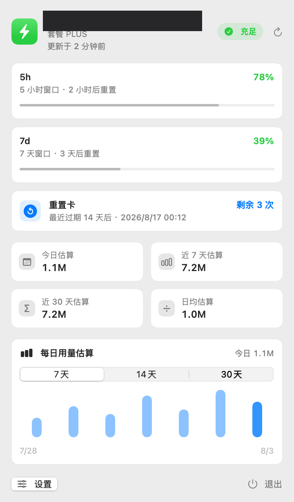
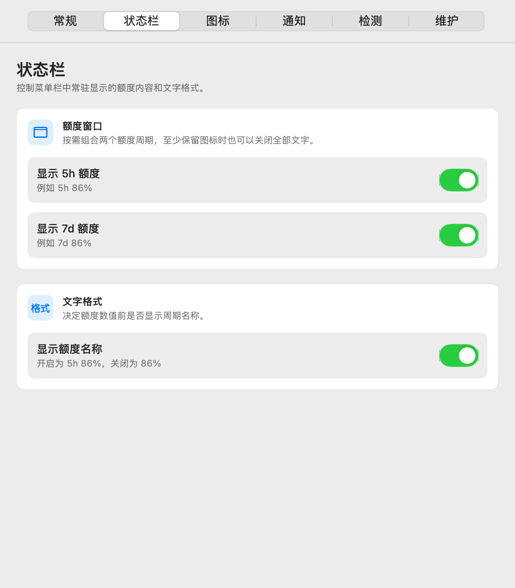
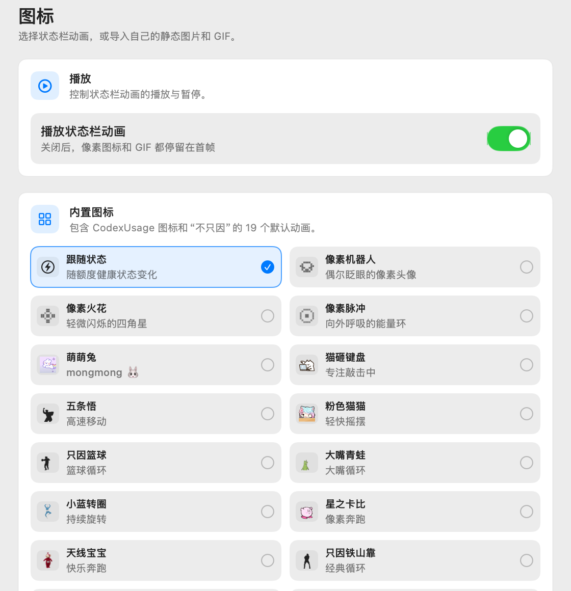

# Codex 用量

一个原生 macOS 状态栏应用，用于展示 Codex 最新用量快照，包括剩余百分比、重置时间、通知提醒，以及可供 WidgetKit 小组件读取的共享状态。

## 当前功能

- 状态栏显示 Codex 剩余额度。
- 状态栏默认同时显示 `5h` 和 `7d` 剩余额度，使用 `5h 86% · 7d 88%` 这类紧凑格式；也可在设置中勾选要展示的窗口，并控制是否展示窗口标签。
- 展开面板查看 `5h` / `7d` 额度窗口。
- 优先通过 Codex OAuth 凭据读取服务端用量窗口，失败时回退解析本地 `~/.codex/sessions/**/*.jsonl` 和 `~/.codex/archived_sessions/**/*.jsonl` 中的 token-count 事件。
- 支持低剩余额度、额度恢复、重置卡即将过期和刷新失败通知。
- 支持本机 Codex 智能状态检测，并保存最近检测历史作为对比基线。
- 保存共享快照，供 WidgetKit 小组件读取。
- `WidgetExtension/` 中提供小组件源码骨架。

## 界面预览

<p align="center">
  
</p>

<p align="center"><sub>主面板使用脱敏演示数据，账号信息已使用不可逆遮罩处理。</sub></p>

| 状态栏展示设置 | 动画图标设置 |
| --- | --- |
|  |  |

## 下载

从 [GitHub Releases](https://github.com/cixiangtao/codex-usage/releases/latest) 下载最新版 `CodexUsage-vX.Y.Z.dmg`，打开后将 `CodexUsage.app` 拖入“应用程序”即可。Release 同时提供供应用内自动更新使用的 ZIP 包和 `SHA256SUMS.txt`。

## 数据来源说明

应用会优先读取 `~/.codex/auth.json` 中 Codex CLI 已保存的 OAuth access token，并直接请求 `chatgpt.com` 的 Codex 用量接口获取 5h / 7d 用量窗口和重置卡信息。它不会读取、保存或上传密码，也不会把 token 写入应用自己的配置。

如果 OAuth 凭据不存在、过期或接口不可用，应用会回退读取 Codex 已经写入本地会话日志的结构化 `rate_limits` 快照。每日 token 趋势来自本地 `sessions` / `archived_sessions` JSONL 的 token-count 事件，会按事件时间聚合通用 Codex 用量：日志里有账号标识时要求匹配当前账号；当前 Codex token-count 通常不带账号标识，这部分只能作为本机未归属用量纳入，所以切换账号后可能包含本机其他账号的历史。如果本地事件不可用，最后回退读取 `~/.codex/state_5.sqlite` 中的线程级 `tokens_used` 汇总。由于 Codex app / 个人资料页统计来自服务端口径，本地趋势仍可能和服务端日统计不完全一致。

额度轮询和本地趋势计算彼此独立：状态栏按设置间隔请求远端额度，不会反复扫描历史日志；展开菜单时才会按 10 分钟缓存周期更新趋势。首次更新会分块读取近 30 天日志并在 `~/Library/Application Support/CodexUsage/LocalTrendIndex-v2.json` 建立派生索引，后续只读取新增字节。账号范围、时区、日志截断或替换发生变化时，相关索引会自动失效或局部重建；删除该索引文件也可以触发完整重建。

## 本地运行

```sh
swift run CodexUsage
```

这个仓库是 Swift Package，不需要生成 Xcode 工程也能编译运行。要发布为带小组件的签名 `.app`，需要用 Xcode 打开包，添加 macOS Widget Extension target，然后把 `WidgetExtension/CodexUsageWidget.swift` 加入该 target。

首次使用开发、打包或发布脚本前，先安装 Bun 脚本依赖：

```sh
bun install
```

开发时可以使用 watch 脚本自动重启应用：

```sh
bun run dev:watch
```

脚本会监听 `Package.swift`、`Sources/` 和 `WidgetExtension/` 下的 Swift 文件变化。保存后会停止当前 `CodexUsage` 进程并重新执行 `swift run CodexUsage`，省去手动重启。

设置里的测试通知按钮只会在 Debug 构建中展示，`swift run CodexUsage` 和 `bun run dev:watch` 可见；release 打包后的 `.app` 不会展示。

## 打包

```sh
bun run package:app
```

脚本会执行 `swift build -c release`，并生成 `dist/CodexUsage.app`。可以用环境变量覆盖包标识和输出目录：

```sh
BUNDLE_IDENTIFIER=com.example.CodexUsage OUTPUT_DIR=/tmp bun run package:app
```

默认构建和 GitHub Actions Release 都使用 ad-hoc 签名。浏览器下载的 DMG 或 ZIP 会被 macOS 加上隔离标记，Gatekeeper 可能提示“Apple 无法验证 CodexUsage 是否包含恶意软件”。本机自用时可以在安装到 `/Applications` 后移除隔离标记：

```sh
xattr -dr com.apple.quarantine /Applications/CodexUsage.app
open /Applications/CodexUsage.app
```

要生成下载后可正常打开的发布包，需要使用 Apple Developer ID 证书签名并公证。先把 notarytool 凭据存到钥匙串：

```sh
xcrun notarytool store-credentials codex-usage-notary \
  --apple-id you@example.com \
  --team-id TEAMID12345 \
  --password app-specific-password
```

然后用 Developer ID 身份打包：

```sh
APPLE_SIGNING_IDENTITY="Developer ID Application: Your Name (TEAMID12345)" \
APPLE_NOTARY_KEYCHAIN_PROFILE=codex-usage-notary \
bun run package:app
```

脚本会在签名前清理常见 bundle 扩展属性，使用 hardened runtime 签名，提交 Apple 公证，staple 公证票据，并执行 Gatekeeper 校验。CI 生成 ZIP 时会禁用资源叉和扩展属性，避免把构建机的 quarantine/provenance 元数据写进发布包。

发布版本时建议同时写入 app 版本号和构建号：

```sh
VERSION=1.2.3 BUILD_NUMBER=456 bun run package:app
```

## GitHub Actions 发布

正式发布必须先通过专用 Release PR。完整操作见 [RELEASING.md](RELEASING.md)：从最新 `master`
创建 `release/vX.Y.Z`，仅更新 `package.json` 与 `bun.lock`，等待 CI 通过后合入。无关 PR 可以继续保持打开。

[Release workflow](https://github.com/cixiangtao/codex-usage/actions/workflows/release.yml) 会在版本文件进入
`master` 时运行门禁，并且只有能反查到上述已合并 Release PR 时才继续：

1. 校验合并 PR、发布分支、受限文件差异、目标版本和现有 tag 状态。
2. 执行 TypeScript 类型检查与 Swift 测试。
3. 使用 PR 中已经批准的版本构建 `.app`。
4. 进行 ad-hoc 签名，生成并校验 `CodexUsage-vX.Y.Z.dmg`、自动更新用 ZIP 和 `SHA256SUMS.txt`。
5. 在 Release PR 的合并提交上创建 `vX.Y.Z` tag。
6. 在同一 Actions 链中创建 GitHub Release、上传并复核资产。

工作流使用仓库自带的短期 `GITHUB_TOKEN`，不需要保存个人访问令牌。手工 tag、直接 push 和
workflow dispatch 都不能发布版本；如果 tag 已创建但 Release 未完成，可以重新运行同一个工作流补全。

本地仍可运行 `bun run package:app` 验证打包，但它不会创建提交、tag 或远端 Release。

## 更新检测

设置窗口会从 GitHub Release API 检查最新版本：

```text
https://api.github.com/repos/cixiangtao/codex-usage/releases/latest
```

应用会读取本地 `CFBundleShortVersionString`，和最新 Release 的 tag 版本比较；tag 建议使用 `v1.2.3` 这种语义化版本。检测到新版本后，如果 Release asset 中包含 `CodexUsage*.zip`，设置页会提供“下载并安装”：应用会自动下载 zip、解压出新的 `.app`、退出当前进程、替换应用并重新打开。通过 `swift run` 启动的开发环境不能替换自身，会回退为打开发布页。

仓库和 Release 必须保持公开，应用才可以在不保存 GitHub 凭据的情况下检查并下载更新。

## 小组件设置

1. 在 Xcode 中创建名为 `CodexUsageWidgetExtension` 的 macOS Widget Extension。
2. 将 `WidgetExtension/CodexUsageWidget.swift` 加入小组件 target。
3. 给主 app 和小组件都添加 App Group entitlement，例如 `group.com.anys.codexusage`。
4. 保持 `SharedSnapshotStore.appGroupIdentifier` 中的 group id 一致。

没有 App Group entitlement 时，状态栏 app 仍可运行，并会把快照存在标准 `UserDefaults`；小组件需要 App Group 才能读取 app 写入的最新快照。

## 参与贡献与问题反馈

普通缺陷和功能建议可以通过 [GitHub Issues](https://github.com/cixiangtao/codex-usage/issues) 提交。参与开发前请阅读 [CONTRIBUTING.md](CONTRIBUTING.md)；涉及凭据、隐私、自动更新或发布链的问题请按照 [SECURITY.md](SECURITY.md) 私密报告，不要创建公开 Issue。

## 许可证

CodexUsage 采用 [MIT License](LICENSE)，Copyright © 2026 cixiangtao。内置第三方资源的来源和许可证见 [THIRD_PARTY_NOTICES.md](THIRD_PARTY_NOTICES.md)。
